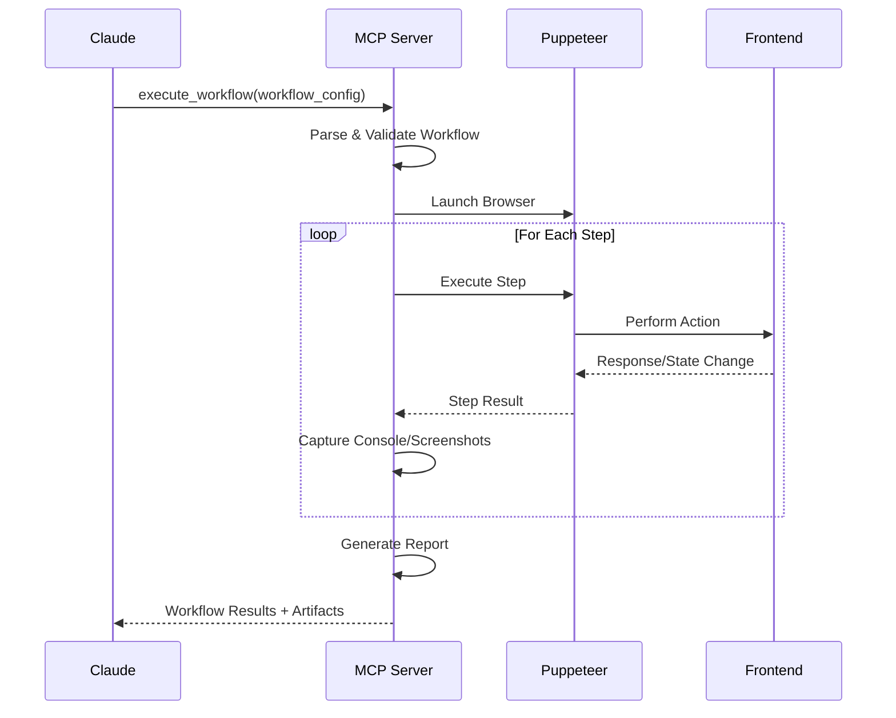

# Frontend Testing MCP Architecture

## Overview

This architecture enables Claude to execute complex frontend testing workflows through an MCP (Model Context Protocol) server that interfaces with Puppeteer. The system is designed to be frontend-agnostic and work with any web-based UI.

## System Components

```
┌─────────────────────┐
│   Claude Code CLI   │
│  (MCP Client)       │
└──────────┬──────────┘
           │ MCP Protocol (stdio)
           │
┌──────────▼──────────┐
│   MCP Test Server   │
│  (Orchestrator)     │
├─────────────────────┤
│ • Workflow Engine   │
│ • Step Executor     │
│ • Console Capture   │
│ • Screenshot Manager│
│ • Report Generator  │
└──────────┬──────────┘
           │
┌──────────▼──────────┐
│     Puppeteer       │
│  (Browser Control)  │
└──────────┬──────────┘
           │
┌──────────▼──────────┐
│   Target Frontend   │
│ • React/Vue/Angular │
│ • Static HTML       │
│ • Server-side apps  │
└─────────────────────┘
```

## Workflow Definition Schema

Workflows are defined as JSON/YAML configurations that describe test sequences:

```typescript
interface TestWorkflow {
  name: string;
  description: string;
  config: {
    baseUrl?: string;
    viewport?: { width: number; height: number };
    timeout?: number;
    headless?: boolean;
  };
  steps: TestStep[];
  assertions?: Assertion[];
  cleanup?: CleanupStep[];
}

interface TestStep {
  id: string;
  type: StepType;
  description?: string;
  selector?: string;
  value?: any;
  options?: StepOptions;
  screenshot?: boolean;
  waitBefore?: number;
  waitAfter?: number;
  retryCount?: number;
}

type StepType = 
  | 'navigate'
  | 'click'
  | 'type'
  | 'select'
  | 'upload'
  | 'wait'
  | 'scroll'
  | 'hover'
  | 'evaluate'
  | 'screenshot'
  | 'assertText'
  | 'assertVisible'
  | 'assertValue'
  | 'customScript';
```

## Frontend-Specific Adapters

### 1. React Applications
```yaml
# Example React workflow
name: "React Form Submission"
steps:
  - type: navigate
    value: "http://localhost:3000"
  - type: wait
    selector: "[data-testid='app-loaded']"
  - type: click
    selector: "[data-testid='open-form-button']"
  - type: type
    selector: "input[name='email']"
    value: "test@example.com"
  - type: assertText
    selector: ".validation-message"
    value: "Email is valid"
```

### 2. Vue.js Applications
```yaml
# Example Vue workflow
name: "Vue Component Interaction"
steps:
  - type: navigate
    value: "http://localhost:8080"
  - type: wait
    selector: "#app"
  - type: evaluate
    value: "window.$nuxt !== undefined"
  - type: click
    selector: ".v-btn--primary"
```

### 3. Angular Applications
```yaml
# Example Angular workflow
name: "Angular Material Form"
steps:
  - type: navigate
    value: "http://localhost:4200"
  - type: wait
    selector: "app-root"
  - type: click
    selector: "mat-select[formControlName='category']"
  - type: click
    selector: "mat-option[value='electronics']"
```

## Key Features

### 1. Console Log Capture
```typescript
interface ConsoleCapture {
  timestamp: Date;
  level: 'log' | 'info' | 'warn' | 'error';
  message: string;
  source?: string;
  stackTrace?: string;
}
```

### 2. Screenshot Management
```typescript
interface ScreenshotOptions {
  fullPage: boolean;
  clip?: { x: number; y: number; width: number; height: number };
  quality?: number;
  type?: 'png' | 'jpeg';
  annotate?: {
    highlights?: string[]; // CSS selectors to highlight
    labels?: Array<{ selector: string; text: string }>;
  };
}
```

### 3. Network Monitoring
```typescript
interface NetworkCapture {
  requests: NetworkRequest[];
  responses: NetworkResponse[];
  failedRequests: FailedRequest[];
}
```

### 4. Performance Metrics
```typescript
interface PerformanceMetrics {
  pageLoadTime: number;
  firstPaint: number;
  firstContentfulPaint: number;
  largestContentfulPaint: number;
  totalBlockingTime: number;
  cumulativeLayoutShift: number;
}
```

## MCP Tools Structure

### Core Tools
1. **execute_workflow** - Run a complete test workflow
2. **execute_step** - Run a single test step
3. **capture_state** - Capture current page state (console, network, performance)
4. **generate_report** - Generate test execution report

### Utility Tools
1. **validate_workflow** - Validate workflow syntax
2. **list_workflows** - List available workflow templates
3. **debug_selector** - Test CSS selectors interactively
4. **compare_screenshots** - Visual regression testing

## Integration Flow



## Error Handling Strategy

1. **Retry Mechanism**: Configurable retry for flaky operations
2. **Graceful Degradation**: Continue workflow on non-critical failures
3. **Detailed Error Context**: Screenshots, console logs, and DOM state on failure
4. **Recovery Actions**: Define fallback steps for common failure scenarios

## Extensibility

### Custom Step Types
```typescript
interface CustomStepHandler {
  name: string;
  validate: (step: TestStep) => boolean;
  execute: (page: Page, step: TestStep) => Promise<StepResult>;
}
```

### Framework Plugins
```typescript
interface FrameworkPlugin {
  name: string;
  detect: (page: Page) => Promise<boolean>;
  setup: (page: Page) => Promise<void>;
  helpers: Record<string, Function>;
}
```

## Security Considerations

1. **Sandbox Execution**: Run tests in isolated browser contexts
2. **Input Sanitization**: Validate all workflow inputs
3. **Resource Limits**: Timeout and memory constraints
4. **Credential Management**: Secure handling of test credentials

## Example Use Cases

### 1. E-commerce Checkout Flow
- Add items to cart
- Apply discount code
- Fill shipping information
- Complete payment
- Verify order confirmation

### 2. User Authentication
- Navigate to login
- Enter credentials
- Handle 2FA
- Verify dashboard access
- Test logout

### 3. Form Validation
- Fill form with various inputs
- Trigger validation
- Verify error messages
- Submit valid form
- Confirm success state

### 4. SPA Navigation
- Test client-side routing
- Verify state persistence
- Check deep linking
- Test browser back/forward
- Validate URL updates

## Benefits

1. **Frontend Agnostic**: Works with any web technology
2. **Declarative Workflows**: Easy to understand and modify
3. **Comprehensive Reporting**: Screenshots, logs, and metrics
4. **Reusable Components**: Share steps across workflows
5. **CI/CD Integration**: Headless execution for automation
6. **Visual Debugging**: Step-by-step screenshots and state capture