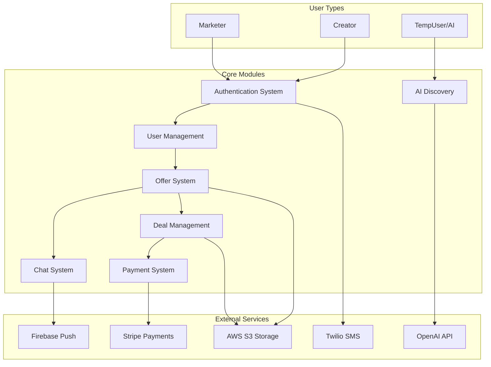
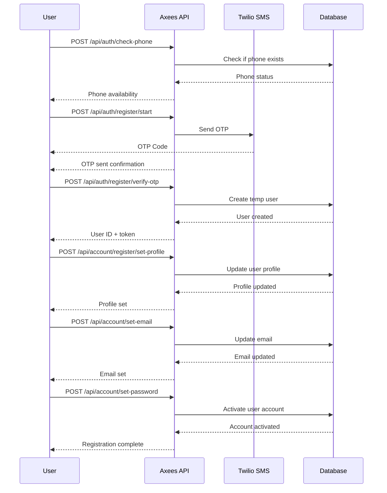
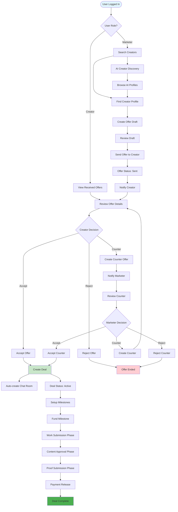
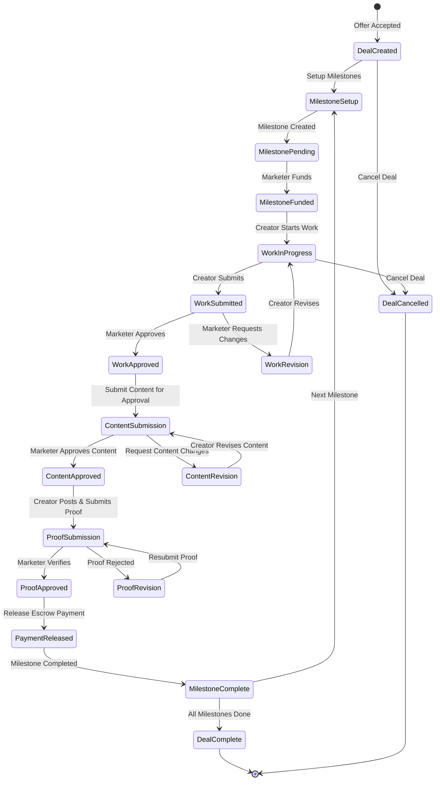
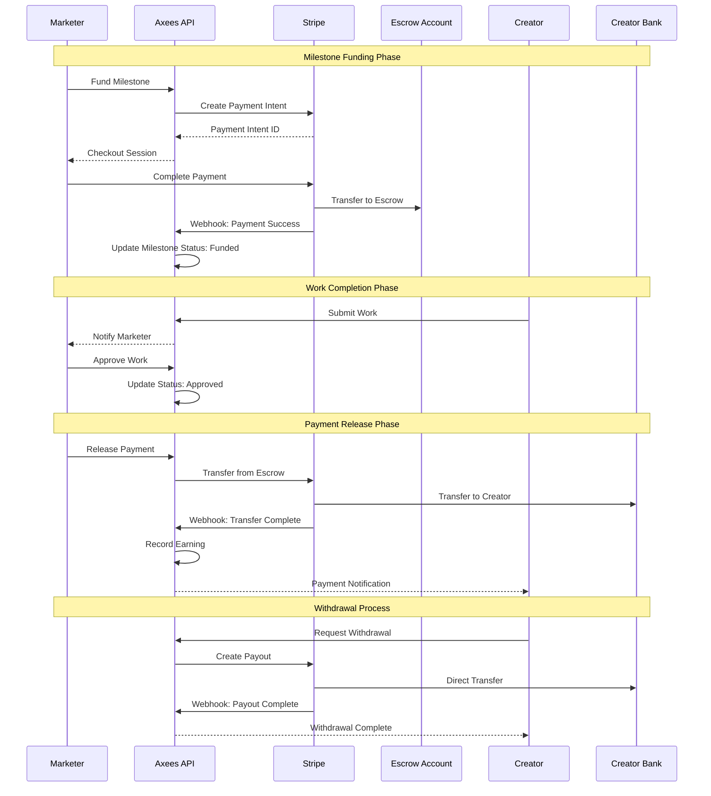
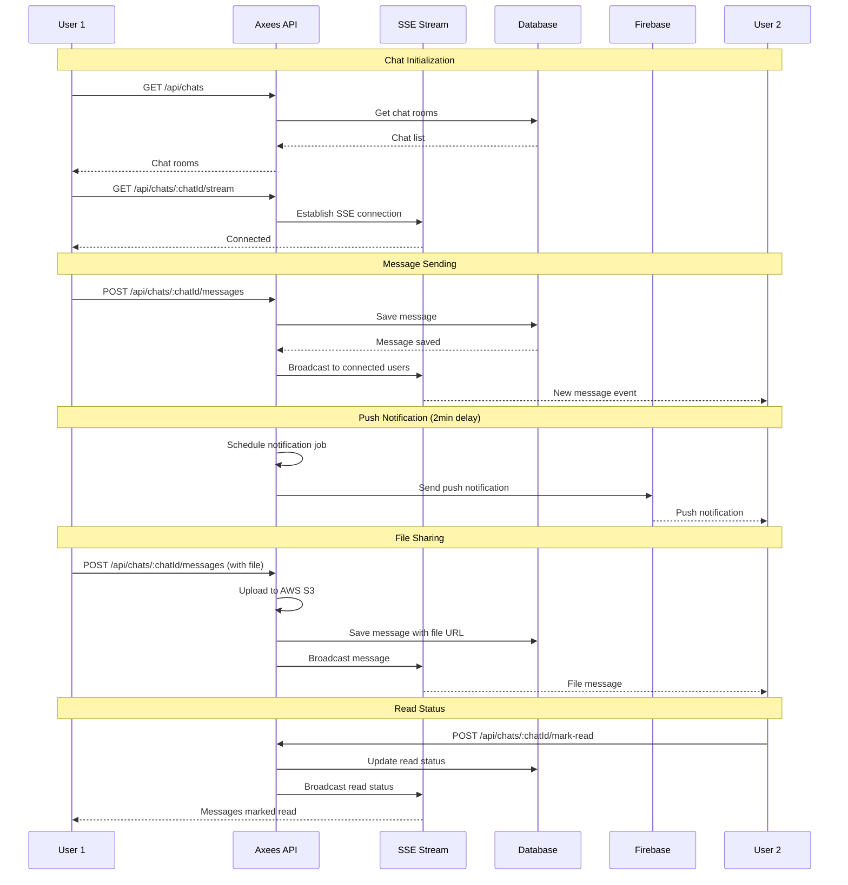
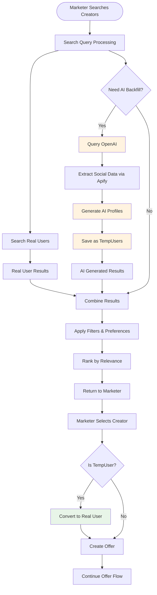
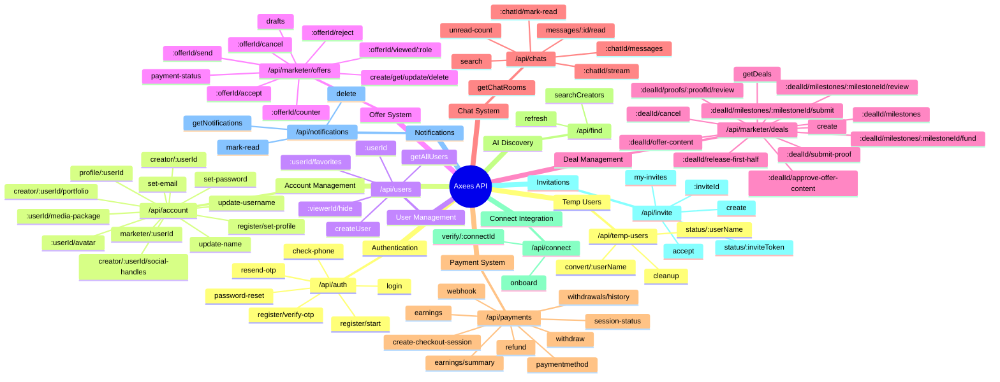
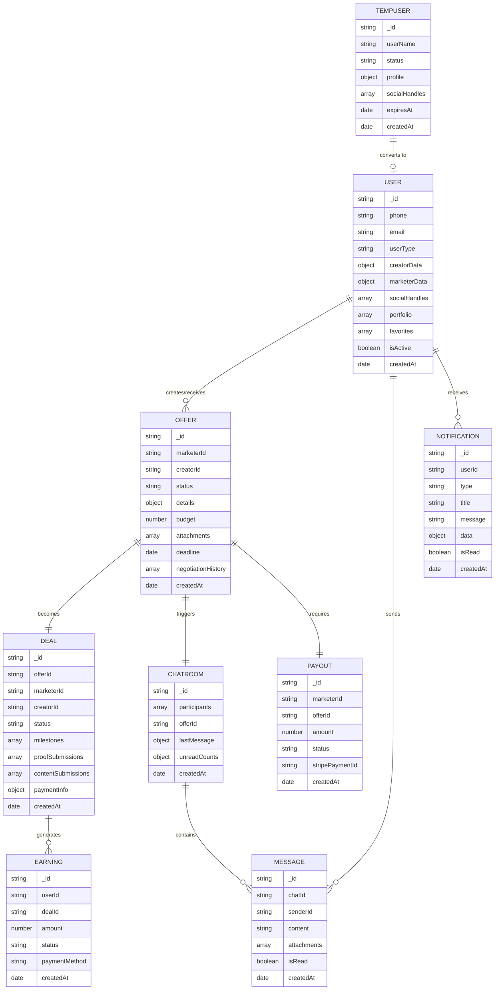
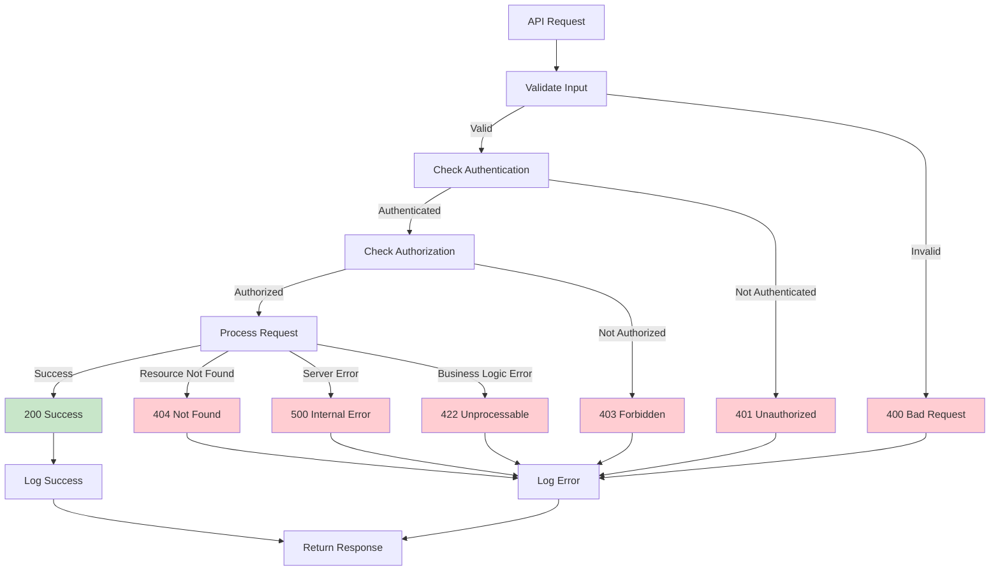

# Axees Platform - Complete Workflow Diagrams

## 1. Overall System Architecture

## 2. User Registration & Onboarding Flow

## 3. Complete Offer-to-Deal Workflow

## 4. Deal Execution & Milestone Management

## 5. Payment & Escrow System Flow

## 6. Real-time Chat & Communication Flow

## 7. AI Creator Discovery System

## 8. Complete API Endpoint Mapping

## 9. Data Model Relationships

## 10. Error Handling & Status Flow

---

## Summary

The Axees platform is a comprehensive influencer marketing platform with the following key characteristics:

### **Core Workflows:**
1. **User Onboarding** - Multi-step registration with OTP verification
2. **Creator Discovery** - AI-powered search with real-time backfill
3. **Offer Management** - Complex negotiation system with status tracking
4. **Deal Execution** - Milestone-based project management
5. **Payment Processing** - Escrow system with Stripe integration
6. **Real-time Communication** - Chat system with file sharing
7. **Content Management** - Approval workflows for deliverables

### **Technical Features:**
- **110+ API Endpoints** across 11 major modules
- **Real-time messaging** with Server-Sent Events
- **AI Integration** for creator discovery and profile generation
- **Comprehensive payment system** with escrow and automated payouts
- **Multi-stage approval workflows** for content and proof verification
- **Advanced notification system** with push notifications

### **Data Flow:**
- **User-centric design** with role-based permissions (Marketer/Creator)
- **Event-driven architecture** with status transitions
- **Comprehensive audit trails** for all transactions
- **Integration with external services** (Stripe, Firebase, Twilio, OpenAI)

This represents a production-ready, enterprise-grade platform for managing the complete influencer marketing lifecycle.